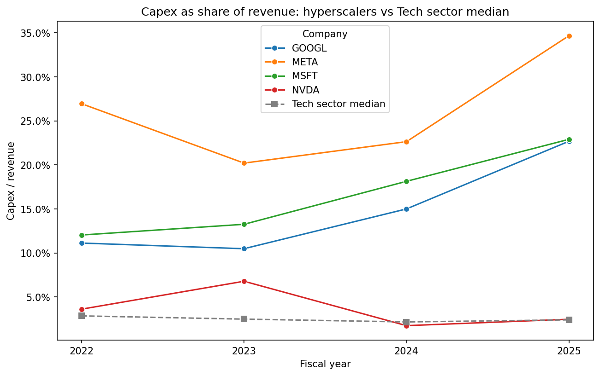
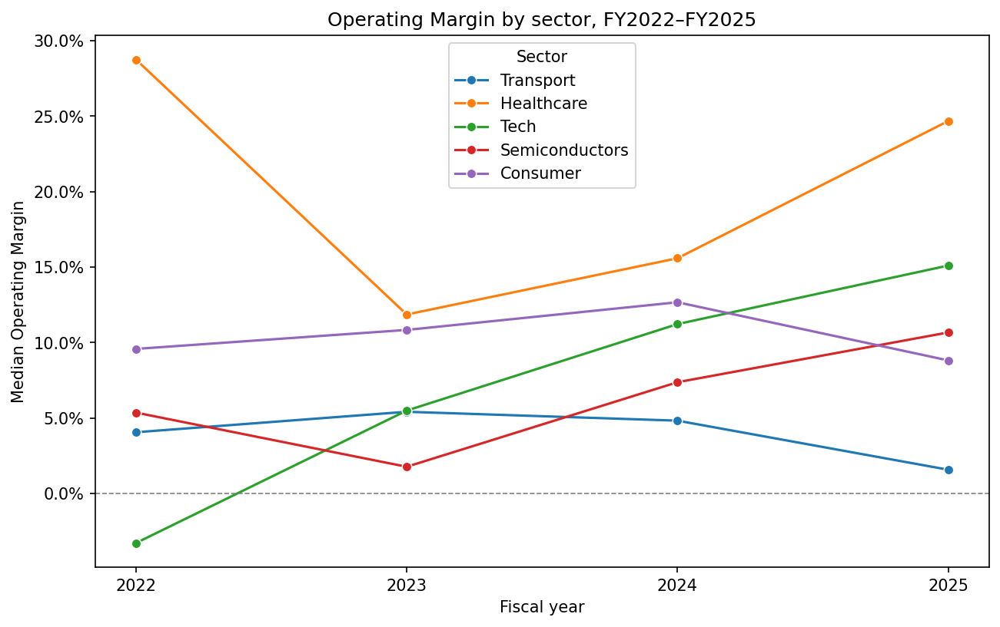

# Company Financials Analysis

An exploratory data analysis of 56 US-listed companies across six sectors, using
reported financial statements from FY2022 to FY2025 — a period covering the
interest rate shock, the tech layoffs, and the start of the AI infrastructure
buildout.

## Key findings

**The 2022 "tech crash" did not appear in revenue.** Tech revenue grew 10–16%
every year of the period. What fell was share prices, not sales.

**Tech margins recovered without a smaller workforce.** The median Tech operating
margin rose from −3.3% to 15.1%, while median headcount was unchanged. Revenue
grew 24.4% with the same number of people.

**The AI capex wave is invisible at sector level.** Tech's median capital
expenditure stayed flat near 2.4% of revenue, while Meta, Microsoft and Alphabet
each spent ten times that. A median cannot detect a phenomenon concentrated in
three companies.

**Reported bank financials are unusable for margin analysis.** JPMorgan's FY2021
gross profit exceeds its revenue, which is arithmetically impossible — a
consequence of how the data source constructs the figure for banks.





## Data

- **Source:** Financial Modeling Prep API: income statement, balance sheet,
  cash flow statement, and employee count
- **Coverage:** 56 companies, 280 company-years; analysis restricted to
  FY2022–FY2025
- **Sectors:** Tech (14), Financials (12), Consumer (10), Transport (9),
  Healthcare (8), Semiconductors (3)
- **Derived metrics:** revenue growth, gross/operating/net margin, R&D and capex
  as a share of revenue, free cash flow margin, debt-to-equity, revenue per
  employee

## Method

`notebooks/01-fetch-data.ipynb` pulls four endpoints per company, caches every raw
response to disk, and assembles them into a single tidy table
(`data/financials.csv`). Caching means the notebook re-runs without spending API
quota.

`notebooks/02-analysis.ipynb` reads that file, documents its data quality
problems, computes derived metrics, and answers four questions with one chart and
a written interpretation each:

1. How did revenue growth vary across sectors?
2. Which sectors defended their operating margins?
3. Did the layoffs make companies more productive?
4. Did the AI capex wave show up in the accounts?

## Limitations

**Company selection was constrained by the data source.** The FMP free tier
restricts requests to a fixed list of roughly 85 tickers, so the sample was built
from what was available rather than chosen freely. Energy was dropped entirely —
only three usable tickers existed — and Semiconductors contains just three
companies, so its median should be read as describing Nvidia, AMD and Intel
individually.

**Financials are excluded from most questions.** Banks have no cost of goods sold,
so gross profit is undefined for them, and the figure the source supplies is
constructed rather than reported. Their revenue figures are similarly distorted by
gross interest flows during the rate cycle.

**Fiscal years do not align across companies.** Microsoft's ends in June, Nike's
in May, most others in December, so "FY2023" covers different twelve-month periods
depending on the company.

**Figures are nominal.** Nothing is adjusted for inflation, which was substantial
over this period and accounts for part of every increase shown.

**Sector medians hide within-sector spread.** Healthcare's 2025 median sits in a
group where one company reports an operating margin of −158%.

## Running it

```bash
git clone https://github.com/leo-bonet/Company-Financials-Analysis.git
cd Company-Financials-Analysis
pip install -r requirements.txt
```

`notebooks/02-analysis.ipynb` runs as-is — `data/financials.csv` is committed, so
no API key is needed to reproduce the analysis.

To re-fetch the raw data, add an FMP API key to a `.env` file in the project root:

```
FMP_API_KEY=your_key
```

then run `notebooks/01-fetch-data.ipynb`. Note the free tier allows 250 requests
per day and 56 companies require 224.